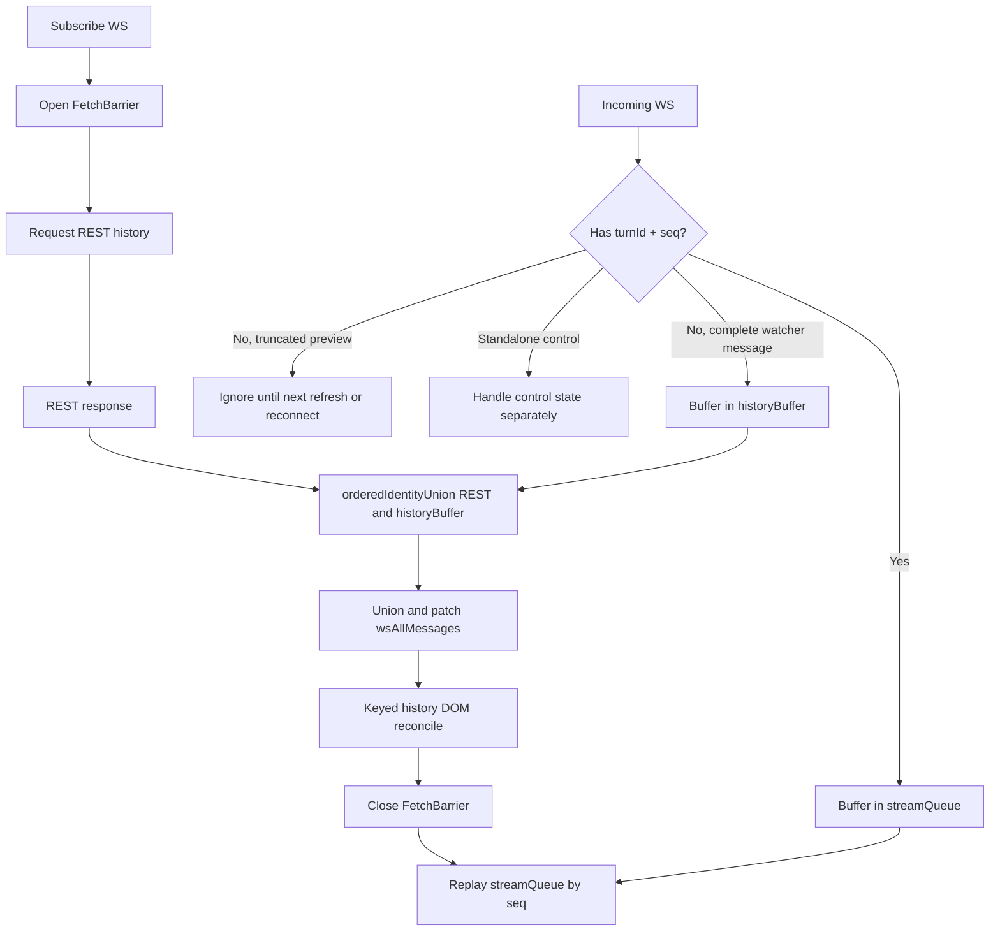
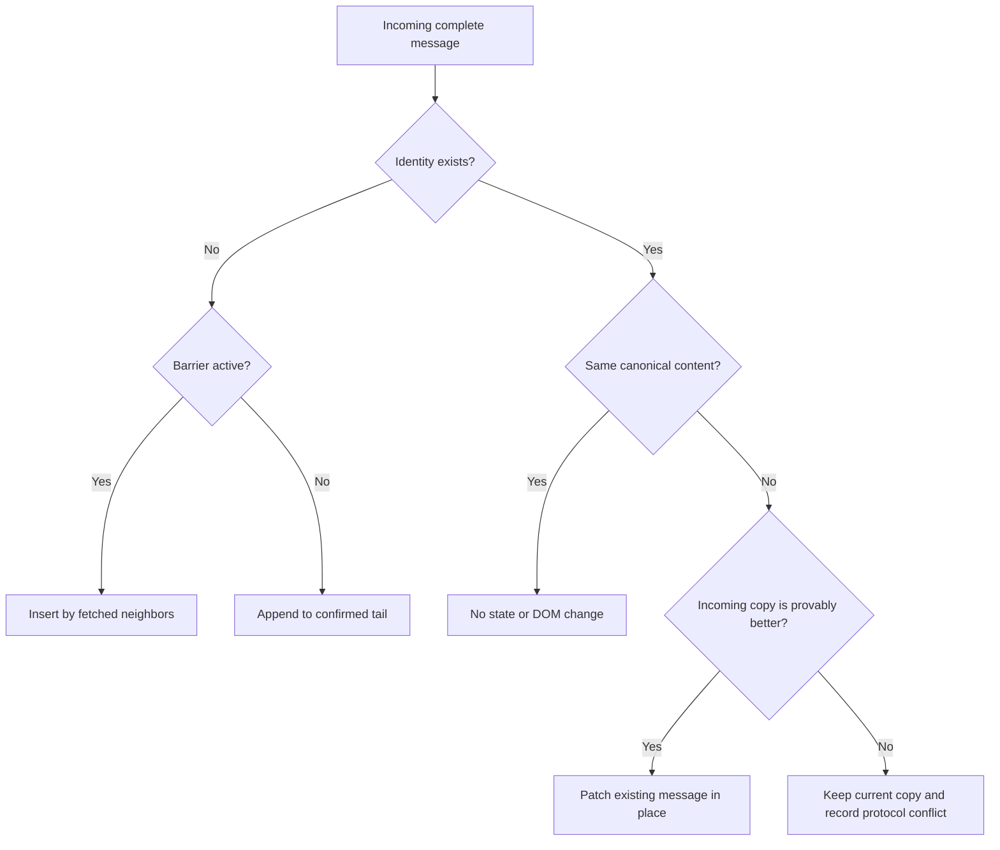

# Message History Merge and Streaming Recovery

> 状态：已实现
> 日期：2026-08-27
> 范围：Web 前端的 REST 历史加载、请求期 WebSocket 缓冲、本地历史合并和 streaming 恢复

## 1. 要解决的问题

Web 打开 Session、从后台回到前台、WS 重连或在 `stream_end` 后补漏时，都会请求
`/api/bridge/messages`。请求期间仍可能收到 WS 数据。

当前实现没有清晰分开以下数据：

- REST 返回的持久化历史；
- 外部 TUI/IDE JSONL watcher 发送的无 seq 完整消息；
- 带 `turnId + seq` 的 strict streaming 事件；
- 已经确认并显示的本地历史 `wsAllMessages`；
- 尚未确认的 optimistic 用户消息；
- 只存在于 DOM 中的 streaming preview。

这导致多套合并和渲染逻辑同时存在：

- 普通 `bufferAndFetch` 使用 `WS buffer + REST`，再对整个 `wsAllMessages` 按 timestamp 排序；
- authoritative recovery 忽略请求期间的 `_wsBuffer`，并猜测 prompt/tail 边界；
- REST 完成后的新 WS 消息仍可能按 timestamp 插入历史 DOM；
- `wsAllMessages`、DOM 顺序和 `wsLastTimestamp` 可能不一致；
- `_wsBuffer` 是全局单例，重叠请求可能互相覆盖。

目标是把流程收敛为：

```text
REST + 完整 historyBuffer
→ 合并到 confirmed history
→ 更新历史 DOM
→ 解除 barrier
→ 消费 strict streamQueue
```

## 2. 核心算法与流程图

实现时只保留三个步骤：

```text
1. F = orderedIdentityUnion(REST, historyBuffer)
2. L = orderedIdentityUnionAndPatch(wsAllMessages, F)
3. reconcileHistoryDom(L)，完成后 replay(streamQueue)
```

其中：

- union 只按稳定 identity 去重；
- 相同 identity 只允许确认或 patch，不新增节点；
- REST 缺少本地 identity 不能触发删除；
- barrier 内补回的历史按 `fetchedMessages` 邻居关系放置；
- barrier 结束后的普通新 WS identity 只能追加到 confirmed timeline 尾部；
- strict streaming 永远只走 `TurnEventQueue`。



消息级决策只有以下几种：



### 2.1 正确性不变量

整个设计只依赖以下不变量：

1. 同一逻辑消息拥有可匹配的稳定 identity/aliases。
2. REST 数组顺序和 historyBuffer WS 到达顺序在合并过程中保持不变。
3. 同 identity 默认不可变；完整化或修订必须可通过 truncated/provisional/revision 明确判断。
4. strict 事件只进入 `TurnEventQueue`，完整无 seq watcher 消息只进入 `historyBuffer`。
5. REST 页面中缺少某条消息不代表删除；删除必须使用显式 tombstone。
6. 同一 Session 同时只有一个 FetchBarrier 可以提交。
7. 历史 state、DOM 和 cursor 在 barrier commit 中同步更新。

任一不变量被破坏时，处理方式必须是记录诊断并进入显式 recovery，不能静默猜测、重排或删除。

## 3. 数据分层

一次 REST 请求使用以下独立数据：

```text
L = wsAllMessages
    已确认的本地历史，不包含 streaming delta 和 optimistic 用户消息

R = REST messages
    DDB 返回的持久化历史，保留 API 返回顺序

H = historyBuffer
    REST 请求期间收到的无 seq、完整 watcher messages

S = streamQueue
    REST 请求期间收到的所有 turnId + seq 事件

P = pendingSentMessages
    本地尚未确认的 optimistic 用户消息

F = fetched history
    R 与 H 合并后的本次历史结果
```

这几类数据不能共用一个 buffer。

### 3.1 historyBuffer 可以接收

只接收没有 `turnId + seq` 的完整历史消息：

```text
action=messages
uuid/nativeId
无 turnId
无 seq
非 streaming delta
```

它们通常来自没有 runtime ownership 的外部 TUI/IDE JSONL watcher。

`historyBuffer` 只接收 `truncated !== true` 的完整消息。截断预览不属于 confirmed history。

### 3.2 streamQueue 必须接收

以下事件全部进入 `TurnEventQueue`，不能参与 REST 历史数组合并：

```text
stream_turn_start
stream_block_start
stream_delta
stream_tool_input
stream_block_stop
带 turnId + seq 的 messages
带 turnId + seq 的 permission_request / permission_resolved
stream_end
```

`stream_delta` 可能只是长文本中间的一段。缺少对应 `stream_block_start` 时，不能渲染、
不能写入 `wsAllMessages`，也不能与 REST 拼接。

没有 live turn 的 standalone permission 属于控制面 UI：它不进入 historyBuffer，也不参与
历史合并，由独立的 permission 状态处理。

带 seq 的 authority `messages` 只有在 `TurnEventQueue` 按序消费后，才能 upsert 到 confirmed
history。REST barrier 未完成时，它们不能提前修改 `L`。

### 3.3 pending 用户消息独立保存

optimistic 用户消息不属于持久化历史：

- 不参与 REST/history 合并；
- 历史 DOM 更新前临时取下；
- 更新完成后按发送顺序放回底部；
- strict turn 继续通过 `data-anchor=turnId` 定位对应用户消息。

## 4. REST Fetch Barrier

初次进入、前后台恢复、WS 重连和 `stream_end` 补漏复用同一套 barrier：

1. 先订阅 WS。
2. 创建本次请求专属的 `FetchBarrier`。
3. 发起 REST。
4. REST 未完成时：
   - 完整无 seq watcher 消息进入 `H`；
   - strict 事件进入 `S`；
   - strict 事件可以排序，但不能修改历史 DOM。
5. REST 返回后合并 `R + H`。
6. 将结果合并到 `L`，显式更新历史 DOM。
7. 标记历史渲染完成。
8. 按 seq 消费 `S`。

请求状态必须按 request/session 隔离：

```text
FetchBarrier {
  generation
  sessionId
  historyBuffer
  state: open | committing | closed
  followUpReasons
}
```

不能继续使用可被其他请求覆盖的全局 `_wsBuffer`。

同一 Session 同一时刻只运行一个 barrier：

- 后续调用复用当前 barrier 的 Promise；
- 当前请求范围不足时，只记录 `followUpReasons`，当前 barrier 关闭后再决定是否补发；
- 不并行启动第二个 messages REST 请求；
- 旧 generation 的 REST 响应不能修改 state 或 DOM；
- Session 切换后，旧 Session 的 barrier 立即失效；
- commit 必须同步完成历史 state、DOM 和 cursor 更新，再切换为 `closed`；
- `closed` 之后到达的 WS 按正常实时路径处理，不能回写旧 buffer。

这里只要求历史列表结构和 keyed reconcile 同步提交。图片、diff、Mermaid 等异步 hydration
不阻塞 barrier 关闭，也不能改变消息顺序。

## 5. 合并 REST 与 historyBuffer

消息 identity 规则：

```text
uuid 优先
显式 identityAliases 用于跨 UUID 对齐
仅在 uuid 缺失时使用 nativeId 兜底
```

每条消息可以提供多个 alias。任意 alias 命中都表示同一逻辑消息；合并后必须把双方 alias
集合做并集，并更新全部 alias 索引。不能只比较一个首选字符串，否则
`codex:turn:<id>:user` 与 `codex:user:<clientId>` 仍可能重复。

`nativeId` 不能单独视为唯一键。真实 Codex DDB 数据中，同一 turn 的不同 user row 以及复用
call ID 的不同工具调用都可能共享 nativeId。REST 与无 seq JSONL watcher 的同一 normalized
消息应使用相同 deterministic UUID；只有显式 alias 才允许合并不同 UUID。

目标算法是保留来源顺序的 identity union：

```text
F = dedupe(R)，不改变 R 的数组顺序
identityIndex = F 的 identity/alias 索引

按 WS 到达顺序遍历 H：
  identity 已存在：
    canonical = resolveDuplicate(existing, incoming)
    必要时原位置替换 canonical

  identity 不存在：
    append 到 F
```

如果 `H` 为空，直接使用 `R`。如果 `R` 为空但 `H` 非空，使用 `H`。

通常 H 是 REST 快照后的尾部。第一阶段不根据 timestamp 或 UUID 重排消息；它只去重、patch
和按 WS 到达顺序追加。

### 5.1 重复副本的选择

同 identity 正常情况下必须代表同一条不可变消息。内容不一致时按以下规则处理：

- 完整版本胜过 `truncated:true`；
- final 版本胜过 provisional；
- 有明确 revision 时使用更高 revision；
- canonical 内容一致时复用已有对象和 DOM；
- `R` 与 `H` 无法判断时保留 REST 副本；
- `F` 与 `L` 无法判断时保留当前本地可见副本；
- 所有无法判断的冲突都记录双方 identity/source/content hash，不能静默覆盖。

协议层应尽量保证同一 identity 不可变。真正的修订应使用 revision 或新的 identity。

### 5.2 truncated watcher 消息

`truncated:true` 的无 seq WS 消息不是最终历史：

- REST 已有同 identity 完整版本时使用 REST；
- REST 尚未包含完整版本时，本次合并直接忽略；
- 它不能进入 `H`、`F` 或 confirmed `L`；
- 不为无 seq watcher 截断消息安排即时补拉；
- 完整版本在下次刷新、前后台恢复或 WS 重连时从 REST 获取。

带 `turnId + seq` 的 strict 大消息仍由 `stream_end/recoveryRequired` 处理；该机制不适用于
无 seq JSONL watcher 消息。

## 6. 合并 fetched history 与 wsAllMessages

`L` 与 `F` 使用 identity union，不做“REST 尾部整体替换”。

```text
遍历 F：
  identity 已存在于 L：
    内容相同 → 不处理
    F 更完整或明确为 final → 原位置 patch

  identity 不存在于 L：
    加入 L
```

核心不变量：

> REST 中缺少某条本地消息，不代表该消息应该被删除。

例如 WS 已经到达，但 DDB 写入仍在进行：

```text
L = A B C D
R = A B C
H = empty
```

合并后必须继续保留 `D`，不能用 REST 尾部替换把它删除。

历史 merge 只允许：

- 确认已有 identity；
- 用更完整版本 patch 已有 identity；
- 增加缺失 identity。

历史 merge 不允许根据 REST 的缺失项删除本地消息。

如果未来支持服务端删除、回滚或隐藏消息，必须发送显式 tombstone/revision；不能继续通过
“某次 REST 页面中不存在”推断删除。

### 6.1 初次进入

本地历史为空：

```text
L = F
```

完成一次历史渲染后再消费 `S`。

### 6.2 已有本地历史

REST barrier 内发现的缺失历史按 `fetchedMessages` 邻居关系插入：

```text
向后找到 fetched 中最近的、已存在于 local 的消息
  → 插到该消息前面

后面没有已存在锚点
  → 追加到 local 尾部
```

barrier 完成后的新 WS 时间线消息不再扫描历史 timestamp，而是追加到已确认历史末尾、
pending 用户消息之前。

只有以下事件可以修改旧节点：

- 相同 identity 的完整 authority；
- `tool_result` 更新对应工具；
- strict authority patch 当前 turn/block；
- 明确标记为 superseded 的 provisional 节点。

普通新 identity 不具备插入或重排历史 DOM 的权限。

这里的“普通新 WS identity”不包括 `tool_result`、相同 identity authority 或 superseded
修正；这些消息本来就通过语义关系更新已有节点。

### 6.3 snapshot 为空

`F` 为空时：

- `L` 保持不变；
- 历史 DOM 保持不变；
- cursor 保持不变；
- barrier 正常结束；
- 继续消费 `S`。

是否重试由调用原因决定，而不是由 `F.length === 0` 决定。

例如 `stream_end.recoveryRequired=true` 表示补漏任务仍未完成，可以延迟重试；普通空
Session、前后台恢复和普通重连不因空 snapshot 自动重试。

## 7. 顺序规则

本次前端重构不尝试从 timestamp/UUID 反推 JSONL 顺序：

- REST 消息保留 API 返回顺序；
- historyBuffer 保留 WS 到达顺序；
- 第一阶段将去重后的 WS 消息追加到 REST 后面；
- 第二阶段使用 `fetchedMessages` 的前后邻居定位本地缺失消息；
- 普通实时新消息追加到 confirmed timeline 尾部；
- 不执行 timestamp/UUID 全局排序。

如果未来要求 REST 完全恢复 JSONL 因果顺序，需要 Bridge/Server 额外透传 JSONL
line/ordinal/subIndex。该跨栈改造不属于本次前端合并重构。

## 8. DOM 更新策略

修改 `wsAllMessages` 不会自动更新原生 DOM。历史更新必须显式执行 keyed reconcile。

```text
identity 相同、内容相同：
  复用原 DOM，不移动、不替换

identity 相同、内容变化：
  原位置 patch 或替换该节点

新增 identity：
  barrier 内按 mergeResult 的目标 index 插入
  barrier 后追加到 confirmed timeline 尾部

pending 用户节点：
  reconcile 前取下，完成后放回底部
```

历史 reconcile 不应重建整个 `.messages`，否则会丢失：

- 工具展开状态；
- 已加载 diff；
- 图片和 Mermaid/KaTeX 状态；
- streaming renderer 的 DOM 引用；
- pending 用户 anchor。

真正的临时 streaming preview 清理由 `StreamCoordinator` 负责，不通过 REST 缺失项推断。

## 9. stream_end 补漏

`stream_end.messages` 为空或 `recoveryRequired=true` 时，REST 请求只负责补齐完整历史消息。

规则：

- REST/history merge 不删除本地已确认历史；
- REST 尚未追上当前 turn 时，保留已有 streaming preview；
- REST 补回相同 identity 后原位置 patch；
- 不完整的 strict block 只能由 authority、后续完整 checkpoint 或明确的 terminal recovery
  收口；
- REST 请求结束并完成历史 DOM 更新后，才释放请求期间的 strict `S`。

补漏重试由“明确存在未完成的 recovery task”决定，而不是由 snapshot 是否为空决定。

recovery task 的完成条件是本次 merge 实际补入或 patch 了目标 turn 缺失的 authority。
`snapshot` 非空但只包含旧历史，不代表 recovery 已完成。没有已知 authority identity 时，
至少要求 cursor 越过 recovery 开始时记录的 baseline，或找到目标 prompt 后的 terminal
authority；否则保留当前 preview，并通过 `followUpReasons` 安排有界重试。

## 10. 与旧消息分页的边界

向上加载旧消息不属于 FetchBarrier 尾部恢复：

```text
olderPage + L
```

旧消息分页只负责 prepend、identity 去重和滚动锚点保持。加载旧页时，新 WS 仍按正常实时路径
追加到底部，两者不能共用同一个 historyBuffer。older-page 响应提交前仍必须校验
session/generation；失效响应不能修改当前 Session。

## 11. 当前实现

生产链路已经收敛到以下文件：

- `web/js/fetch-barrier.js`
  - request-scoped barrier、generation、historyBuffer 和 strict authority buffer；
  - 同请求复用，Session 切换使旧 generation 失效。
- `web/js/history-recovery.js`
  - `mergeFetchWindow(R, H)`；
  - `mergeLocalHistory(L, F)`；
  - identity、alias、patch 和 fetched 邻居插入规则。
- `web/js/history-recovery-commit.js`
  - pending echo、历史提交、barrier 释放、stream replay 和 activity commit 的固定顺序。
- `web/js/history-recovery-dom.js`
  - keyed DOM reconcile、pending/stream preview 保护、spinner 和渲染收尾。
- `web/js/runtime-status.js`
  - Claude/Codex 共用的 running、needs_input、completed 判定。

`ws.js` 只保留协议路由和上述模块的生产 adapter。旧 `_wsBuffer`、timestamp 全量排序、
authoritative prompt/tail 猜测和重复 DOM reconcile 已删除。

barrier 期间，strict lifecycle 状态立即生效；strict authority 历史消息和 streaming DOM
操作延迟到 REST 历史提交之后。barrier 关闭后的普通 watcher 消息只追加到 confirmed tail，
不再根据 timestamp 插入历史中间。

仍属于服务端 cursor 协议的独立问题：

- `/messages?after=` 目前仍以 timestamp 为 cursor；
- 如果未来需要覆盖同 timestamp 的严格分页边界，应升级为服务端提供的稳定复合 cursor。

## 12. 提交流程

统一流程为：

1. `FetchBarrier` 捕获请求开始时的本地历史、pending identity 和 activity。
2. REST 期间：
   - 完整无 seq watcher 消息进入 historyBuffer；
   - strict lifecycle 立即更新状态；
   - strict authority 与 DOM operations 延迟提交。
3. `mergeFetchWindow` 合并 REST 与 historyBuffer。
4. `mergeLocalHistory` 将 fetched history 和延迟 strict authority 合并到请求开始时的本地历史。
5. DOM adapter keyed reconcile，只替换发生变化的节点。
6. pending echo 精确 promotion，未确认 pending 保持在底部。
7. 释放 barrier，消费 strict DOM operations。
8. `resolveActivityState` 提交 spinner 状态。
9. 如果提交前仍保持 bottom-follow intent，全部 DOM 更新后最多滚动一次到底部。

## 13. 验收条件

必须添加并长期保留以下测试：

- REST 无 WS：结果等于 REST。
- REST 为空、historyBuffer 有消息：结果等于 historyBuffer。
- REST 与 historyBuffer 尾部重复：只保留一份，完整 REST 版本胜出。
- 相同 deterministic UUID 的 REST/WS 副本：只保留一份。
- nativeId 相同但 UUID 不同的真实消息：必须全部保留。
- 两种 Codex user alias 指向同一消息：只生成一个 identity 记录和一个 DOM 节点。
- REST 未包含已到达本地但尚未持久化的消息：本地消息不被删除。
- REST barrier 期间收到半截 delta：历史 DOM 不变化。
- REST 完成后从完整 block boundary 消费 strict queue。
- strict queue 只有中间 delta：不渲染残缺文本。
- REST 已包含 strict authority：replay 时只确认或 patch，不复制节点。
- barrier 后普通新 identity：追加到底部，不插入历史。
- tool result：原位置更新工具，不创建底部节点。
- pending 用户消息：历史 reconcile 后仍按发送顺序位于底部。
- truncated WS 与完整 REST 重复：最终显示完整 REST 内容。
- truncated WS 在 REST 尚无完整版本时：忽略且不触发即时 recovery。
- 空 snapshot：不修改历史和 cursor，但仍解除 barrier。
- recovery task 需要重试时：重试行为由任务状态控制。
- 两个 REST 请求重叠：buffer 和响应不能交叉污染。
- 同一 Session 的第二个 REST 请求：加入当前 barrier 或登记 follow-up，不并发执行。
- 旧 generation 的 REST 后返回：不能修改新 generation 的 state、DOM 或 cursor。
- barrier commit 时到达 WS：只能进入当前 barrier 或 closed 后的正常路径，不能丢失。
- 相同 timestamp 的 `tool_use/tool_result`：保持 fetched 数组中的因果顺序。
- 本地缺失 fetched 前缀、中间节点或尾部：按 fetched 邻居稳定插入。
- 同 identity 内容冲突：执行确定性选择并产生诊断。
- 服务端未发送 tombstone：REST 缺失项不能删除本地历史。
- snapshot 只有旧历史：不能错误结束仍缺 authority 的 recovery task。
- 实时显示顺序与重新进入后的 DDB 顺序一致。

## 14. Codex Updated Plan

已兼容两种 app-server 计划协议：

- `item/plan/delta`
  - 保留为旧版/实验性计划文本流；
  - 官方协议明确不保证拼接 delta 等于最终结构化计划，因此不转换为 checklist。
- `turn/plan/updated`
  - 归一化为与 JSONL `update_plan` 相同的 `TodoWrite` 模型；
  - `inProgress` 转换为前端状态 `in_progress`；
  - 相同的连续 snapshot 去重；
  - 通过 strict turn 的 tool block 和 authority messages 实时渲染，不进入 historyBuffer。

本机 Codex 0.150.1 的 schema 与实际 app-server turn 均验证了
`turn/plan/updated { threadId, turnId, explanation, plan }`。真实 turn 不再发送
`item/plan/delta`，修改后的 Bridge 能输出一个完整 `TodoWrite` 节点，并在 reload 后继续与
JSONL `update_plan` 使用相同 UI。
