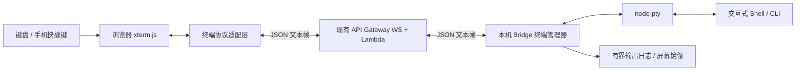

# xterm.js + PTY 远程终端设计

> 状态：已实现项目入口、Header 直转及多端共享 PTY；仍需手机真机兼容性验收。
>
> 2026-09-17 更新：当前实现以 `docs/terminal-direct-integration.md` 的“项目共享终端”章节为准。
> 下文原始方案中的单写入者、接管租约、统一 terminal action 和 replay 协议不是当前实现。
> 用户已明确选择所有已连接页面均可输入，通常只有一人操作，不增加抢占或写入锁。
>
> 最初基线：2026-09-16，`main` / `f3fd719`；设计分支：`xterm`。
> 旧管道方案保存在 `checkpoint/terminal-pipe-baseline-20260915` / `f8c22f9`。
>
> 最初验证使用隔离的本地 POC（§15.2）及云端 WS POC（§15.3），没有重启原有 Bridge。
> 2026-09-17 已部署项目终端页面、更新云端控制接口，并更新 / 重启本机主 Bridge；
> 线上页面直连该主 Bridge 的桌面 / 手机尺寸双端输入、断开后恢复均已验证。
>
> 后续 Header 直转 POC 已实现：见 `docs/terminal-direct-integration.md`。
> 因实测 IAM 无法限制单个 connection ID，数据使用独立托管 WS API + 会话 HMAC，原 API 只做控制。
> 受控 POC 已通过浏览器验收；不把 API 级 STS 权限误称为可面向不可信多租户的连接级 ACL。

## 1. 结论与范围

长期采用 **xterm.js + 本机 PTY + 现有 WebSocket 通道**，将终端作为一个独立子系统实现。

- xterm.js 负责浏览器端的终端屏幕、VT 控制序列、光标、选区和键盘输入。
- PTY 负责让本机 Shell / CLI 获得终端接口，而不是普通 stdin/stdout 管道。
- WebSocket 负责带鉴权、排序、流控和恢复机制的数据传输。
- 云端不创建 PTY、不执行命令、不解析终端画面。命令仍在用户选中的设备上运行。

只替换前端渲染库不能解决非 TTY 程序拒绝启动、提示未输出的问题；只加 PTY 而继续
使用普通日志区域，也不能完整呈现 Vim 等应用。xterm.js 官方推荐的典型接法就是将其
与 PTY 双向连接。[R1][R2]

### 1.1 首个可发布版本的目标

1. macOS、Linux 上的持久交互式 Shell，正确显示安装向导和无换行提示。
2. 支持 Vim、分页器、交互式选择、方向键、Tab、Esc、Ctrl 组合键。
3. 支持桌面浏览器、手机浏览器及现有 Tauri 移动端容器；手机兼容性须实机验收。
4. 支持窗口尺寸变化、同一会话的短线重连和明确的会话生命周期。
5. 输入不重复执行，VT 数据不静默丢弃；无法恢复时明确提示，不伪造完整屏幕。
6. 保留 Reset 确认弹窗；返回页面只断开订阅，不终止 PTY。

### 1.2 本轮不做

- 不增加 `Need input`。PTY 不提供通用的“应用正在等待用户输入”业务事件。
- 不增加 Clear 按钮，不移植旧版命令卡片、退出码统计和 Git 候选条。
- 不模拟 Vim 编辑器，不通过识别命令后切换自定义编辑组件。
- 不实现多用户协同编辑、多终端标签、文件传输、ZMODEM、录屏或终端磁盘历史。
- 不保证 Bridge 重启后进程仍存活；这需要额外的 tmux / 会话守护层。
- Windows ConPTY 放在后续独立验收阶段，不因 node-pty 声称支持就默认上线。

## 2. 从 main 出发，哪些代码可以借鉴

禁止把旧分支整个 cherry-pick 后再替换渲染器。旧版的数据模型是“执行一条命令”，
新版的数据模型是“连接一个持续存在的终端”。

| 位置 | main 现状 / 可复用部分 | 本次设计的处理 |
|---|---|---|
| `bridge/ws.mjs` | 已有鉴权连接、心跳、消息分发、退出清理 | 只增加 terminal 分发和会话清理入口 |
| `bridge/session.mjs` | `projectHashToPath` | 复用定位，随后 realpath、目录检查和权限校验 |
| `bridge/project/ws-frames.mjs` | 根据完整 JSON 大小检查帧 | 借鉴大小检查；不直接复用文本 RPC 分片协议 |
| `bridge/bridge.mjs` | 下载更新、替换文件并重启 | 必须增加活跃 PTY 的更新延迟策略 |
| `server/src/bridge_ws.py` | 按 action 分发、连接身份查询、定向发送 | 保留现有入口，增加独立 terminal handler |
| `server/src/project/git_ws.py` | 请求白名单、可信路由字段构造 | 借鉴校验和定向路由方式 |
| `web/js/ws.js` | 共享 WS、重连、移动端 viewport 处理 | 复用连接；终端输入不用它的离线通用发送队列 |
| `web/js/ws-rpc.js` | 有限请求/响应的 Promise 和超时 | 可借鉴控制请求；不能用来组装无限终端流 |
| `web/js/edge-back.js`、公共 Header | 页面返回、手势和项目导航 | 复用，不重新实现全局导航 |
| `web/js/git/discard-confirm.js`、`.modal-*` | 已有确认弹窗样式 | 复用样式，借鉴旧终端 Reset 的交互测试 |
| 旧分支 `web/js/terminal/page.js` | 顶部入口、Reset 弹窗、页面壳 | 只选择性借鉴，不复制旧输入和输出模型 |
| 旧分支 `bridge/config.mjs` | CLI 启动时保留用户配置 | 保留这一修复思路，避免升级丢失 terminal 开关 |

明确不沿用旧版的 fd 3 / nonce 命令执行循环、`eval`、`execId` 命令卡片、Bash `read`
覆盖函数、stdin 手工回显、输出达到 2 MB 后丢弃、每次全量 `innerHTML` 渲染。

旧版的 `PYTHONUNBUFFERED=1`、`PAGER=cat`、`GIT_TERMINAL_PROMPT=0`、`ls -C` 等设置，
也不能直接复制到完整终端；应让程序根据真实 PTY 和用户 Shell 配置自行工作。

## 3. 总体架构



这是 Bridge 创建的新 PTY 会话，不是读取用户已经打开的 Terminal.app 窗口。
浏览器运行在手机上，也不意味着 Shell 在手机上运行。

### 3.1 两条路径必须分开

- **控制路径**：能力探测、open、attach、Reset、close、查询状态，有请求 ID 和结果。
- **数据路径**：键盘字节、终端输出、尺寸事件、ACK、补发，采用显式序号和窗口。

继续使用当前连接，不再打开一条未经鉴权的裸 WS。不要直接使用 addon-attach 连接
当前共享 WS：该 addon 默认把 WS 内容当终端数据，而现有连接还承载聊天、Files、Git
等 JSON 消息。需要一个薄的、专属终端协议适配层。[R3]

## 4. 依赖与技术选型

以下是 2026-09-15 调研时从 npm 发布元数据查询到的稳定候选，不等于已经验证互相兼容：

| 依赖 | 候选版本 | 用途 | 安装位置 |
|---|---|---|---|
| `@xterm/xterm` | `6.0.0` | 浏览器终端 | 根 package.json，懒加载 |
| `@xterm/addon-fit` | `0.11.0` | 根据容器计算行列数 | 根 package.json |
| `node-pty` | `1.1.0` | 本机 PTY | bridge/package.json |
| `@xterm/headless` | `6.0.0` | 后端屏幕镜像候选 | bridge/package.json，恢复阶段引入 |
| `@xterm/addon-serialize` | `0.14.0` | 屏幕序列化候选 | bridge/package.json，恢复阶段引入 |

这些包的发布元数据标注为 MIT。实施前锁定准确版本及 lockfile，并在对应版本上运行
API、渲染和原生模块测试；不依赖 master 分支或未经验证的 experimental API。[R1][R2][R16]

- 不引入 WebGL、搜索、超链接、剪贴板等全部 addon；基础功能稳定后按需增加。
- xterm 自带终端解析和增量写入能力，不再使用 Anser 为这个页面生成 HTML。
- `node-pty` 有原生依赖，必须验证 macOS arm64/x64、Linux 目标架构的安装和升级。
- `node-pty` 候选版本支持 `encoding: null` 和 `write(string | Buffer)`；其 `onData`
  类型声明仍需结合实际运行结果检查。字节适配不能仅凭类型声明猜测。[R17]

## 5. Bridge 会话与 Shell 启动

### 5.1 会话身份

- `terminalId`：Bridge 生成的 UUID，标识一个终端会话。
- `epoch`：每次创建/重置底层 PTY 都更换的 UUID，旧 epoch 的输入一律拒绝。
- `bridgeInstanceId`：Bridge 启动时生成，用于识别服务重启，不作为鉴权凭证。
- `clientId`：浏览器标签页的随机 ID，可放 sessionStorage；不保存输入内容。
- `attachmentId`：每次 attach 成功生成的随机 ID，绑定当前连接和控制权。

第一版每个设备、每个项目只有一个终端；全设备最多 4 个。没有空位时返回明确错误，
不通过“看起来空闲”推断并杀掉已有 Shell。

内部状态至少包含：PTY handle、项目实际路径、Shell、行列数、epoch、输出序号、
输入序号、控制者、恢复窗口、镜像写队列、流控原因集合、退出结果和请求去重表。

### 5.2 Shell 与环境

1. Bridge 根据本机用户配置选择 Shell；优先用户显式配置，其次系统登录 Shell。
2. 初期仅支持已验收的 macOS/Linux Shell。不得接收前端传来的任意 executable/argv/env。
3. 初始 cwd 由项目定位后 `realpath`，检查存在且为目录；失败不退回一个无关目录。
4. 以登录、交互模式在 PTY 内启动 Shell，不再执行 Bash bootstrap 命令循环。
5. 环境保留必要的 `HOME/USER/LOGNAME/SHELL/PATH/LANG/LC_*`，设置终端类型；
   用户的 pyenv/nvm 等由实际登录 Shell 初始化，避免再次用另一个 Shell 重排 PATH。
6. 不把 Bridge 的 API key、安装参数和服务专用环境整体传给子进程。
7. xterm 主题、TERM、字符宽度与后端镜像配置一致；以 UTF-8 终端作为第一版范围。

`TERM=xterm-256color` 现在对应真实 PTY，而不是拿环境变量假装管道是终端。
环境一致性须比较新 Shell 的解释器路径与用户本机登录 Shell，不能只检查命令能否找到。

### 5.3 输入输出与回显

- 输出：PTY bytes → 分片/镜像/序号 → WS → `terminal.write(Uint8Array)`。
- 普通输入：`terminal.onData` 的字符串用 UTF-8 编码，进入有序输入队列。
- 二进制输入事件：`terminal.onBinary` 按单字节值转换，不能再做 UTF-8 二次编码。
- Bridge 使用 byte-preserving 适配层写入 PTY；Buffer 行为是 P0 必测项。
- 不统一追加 `\n`；回车、方向键、控制键均发送实际终端输入序列。
- 终端只显示真实 PTY 输出，不手工写入输入回显。2026-09-16 已移除桌面输入预览，保留真实网络延迟，
  便于比较 EC2 与本机公网链路；当前范围见 `docs/terminal-direct-integration.md`。

### 5.4 生命周期

| 操作 | 语义 |
|---|---|
| open | 对项目创建或找到已有终端；重复请求不重复启动进程 |
| attach | 绑定控制者，恢复屏幕，恢复完成后才允许输入 |
| 返回 / detach | 停止页面订阅，PTY 保留；不调用 Reset |
| 网络断开 | 禁止新输入，进入重连状态；不把积攒按键自动发给新会话 |
| Reset | 弹窗确认后终止旧 PTY、清屏、换 epoch，在项目初始目录启动新 Shell |
| close | 显式关闭终端，释放进程与内存，不立即自动重开 |
| Shell 自身退出 | 发出有序 exit，页面只读；用户主动选择重新打开 |
| Bridge 重启 | 原 PTY 不保证存活；旧会话失效，不自动重放命令 |

“Reset 回项目初始目录”是新方案的明确语义，不依赖旧版偶然保留的 cwd。
第一版不根据无输出、无按键判断命令已空闲，也不自动清理仍存活的 PTY。

退出清理须测试前台进程组与子进程，不能只验证 Shell PID 消失。主动 `nohup/setsid`
脱离会话的任务不承诺由 Reset 全部回收；PTY 不是进程或文件系统沙箱。

自动升级在存在活跃 PTY 时延迟：可以检查新版，但不得先替换原生依赖再推迟重启。
所有终端关闭后才安装并重启，或由用户显式确认中断升级。

## 6. WebSocket 协议 v1

采用一个新 action：`terminal`，通过 `v: 1` 与 `op` 区分消息。它不兼容旧版
`terminal_exec/terminal_stdin/...` 的含义，也不复用聊天 Session 的 turnId/seq。

### 6.1 通用字段与信任边界

| 字段 | 规则 |
|---|---|
| action / v / op | 固定 action、整数版本、按角色验证 op 白名单 |
| device | 现有设备标识，不使用展示名称；服务器必须定向到唯一 Bridge |
| projectHash | 最大 2048 UTF-8 bytes；Bridge 验证其与终端绑定项目一致 |
| requestId | 控制请求 UUID，重试必须复用原值 |
| terminalId / epoch | UUID；已有终端的操作必须携带 |
| clientId / attachmentId | 控制权和重连身份；不能代替账号鉴权 |
| seq | Bridge 的有序终端事件序号，每个 epoch 从 1 开始 |
| clientSeq | 当前 attachment 的输入/resize 序号，从 1 开始 |
| data | 终端 bytes 的标准 Base64；不是转义后的 ANSI 文本 |

客户端不能指定可信 `accountId/sourceConnectionId/replyConnectionId`。服务器从当前
连接记录得到账号和角色，按白名单重建请求，并注入可信路由信息。Bridge 的响应目标
来自已绑定的 attachment，不采用输入数据中的任意连接 ID。

### 6.2 App → Bridge

| op | 必需的业务字段 | 语义 |
|---|---|---|
| probe | device, requestId | 返回启用状态、协议、平台、限制和实际可用能力 |
| open | projectHash, requestId, cols, rows | 创建/找到项目终端，不直接取得控制权 |
| attach | terminalId, epoch, clientId, requestId, screenPresent, lastSeq, takeover | 恢复屏幕并取得 attachment |
| input | terminalId, epoch, attachmentId, clientSeq, data | 有序写入原始输入 bytes |
| resize | 同 input 的身份/序号，cols, rows | 与输入共用顺序，调整 PTY 和屏幕尺寸 |
| ack | 身份字段，seq，可选 syncId | 确认已应用到 xterm 的连续事件序号 |
| replay | 身份字段，fromSeq | 请求从缺口起补发，不能请求其他终端的数据 |
| snapshot_ack | 身份字段，snapshotId, nextChunk | 确认连续收到的快照块，释放快照发送窗口 |
| keepalive | 身份字段 | 续期控制权；建议每 30 秒一次 |
| detach | 身份字段，requestId | 释放当前控制权，不终止进程 |
| state | terminalId, epoch, requestId | 查询当前会话/请求结果，不执行命令 |
| reset / close | 身份字段，requestId | 有去重保障的显式破坏性操作 |

以上为最初的单写入者协议草案，已被 2026-09-17 的共享终端实现替代。
当前没有 `takeover`、写入租约或 `terminal_in_use`；每个页面具有独立连接和输入序号，
Bridge 按每条连接的连续序号排序，再按到达顺序写入同一 PTY。跨设备不提供命令级原子性。
断线只释放当前页面连接，不杀 PTY；重新连接通过权威屏幕快照恢复，不重放输入。

### 6.3 Bridge → App

| op | 是否进入 seq 流 | 含义 |
|---|---|---|
| capabilities | 否，匹配 requestId | backend、协议版本、启用状态、能力和限制 |
| opened / attached / result / state | 否，匹配 requestId | 控制请求结果、epoch、attachment 或状态 |
| output | 是 | Base64 终端输出 |
| resized | 是 | 权威 cols/rows 和对应 clientSeq |
| flow | 是 | 数据通道流控状态，不代表命令等待输入 |
| exit | 是 | PTY 退出结果；不是任意一条 Shell 命令的退出码 |
| input_ack | 否 | 当前 attachment 已接受的连续 clientSeq |
| lease | 否 | 当前 attachment 的续期结果 |
| snapshot_begin / snapshot_chunk / snapshot_end | 独立 chunkIndex | 同一个同步事务的屏幕快照 |
| error | 否，关联请求或序号 | 明确错误，不靠永久 loading 表示失败 |

控制结果在 JSON 中使用 `ok: true/false`。错误至少带 `errorCode`，按需要带 requestId、
clientSeq、expectedClientSeq、terminalId、epoch；错误消息不得包含输入正文或凭证。

### 6.4 示例

以下为结构示例，UUID 是占位示例；服务器注入的内部路由字段不出现在客户端请求中。

```json
{
  "action": "terminal",
  "v": 1,
  "op": "open",
  "requestId": "11111111-1111-4111-8111-111111111111",
  "device": "MacBook-Pro",
  "projectHash": "-workspace-project",
  "cols": 80,
  "rows": 24
}
```

```json
{
  "action": "terminal",
  "v": 1,
  "op": "input",
  "device": "MacBook-Pro",
  "projectHash": "-workspace-project",
  "terminalId": "22222222-2222-4222-8222-222222222222",
  "epoch": "33333333-3333-4333-8333-333333333333",
  "attachmentId": "44444444-4444-4444-8444-444444444444",
  "clientSeq": 1,
  "data": "bHMN"
}
```

上例 data 表示 `ls` 后跟一个回车 byte。生产代码必须对真实输入 bytes 编码，不能把
`\\r` 等可见字符当作回车。单独的回车 byte `0x0d` 编码为 `DQ==`，Ctrl+C `0x03` 为 `Aw==`。

```json
{
  "action": "terminal",
  "v": 1,
  "op": "output",
  "terminalId": "22222222-2222-4222-8222-222222222222",
  "epoch": "33333333-3333-4333-8333-333333333333",
  "attachmentId": "44444444-4444-4444-8444-444444444444",
  "seq": 7,
  "data": "aGVsbG8NCg=="
}
```

output 例子表示 `hello` 加 CRLF。数据帧只由当前终端适配层消费，不进入聊天渲染器。

### 6.5 排序、幂等与输入安全

1. 不假定经过多个 Lambda 调用的结果仍按原始顺序到达。输出、resized、exit 共用 seq。
2. 浏览器只按连续 seq 应用；重复丢弃，缺口先补发，不能跳过控制序列继续绘制。
3. input 与 resize 共用 clientSeq；Bridge 按顺序执行，有限缓存乱序项并报告缺口。
4. 同一个 attachment 中，重复 clientSeq 不再次写 PTY；相同序号不同 payload 拒绝。
5. input_ack 表示 Bridge 接受并提交给 PTY 写入路径，不表示应用已经读到或完成命令。
6. 去重是同一 Bridge/epoch 内的保证，不宣称跨进程崩溃 exactly-once。
7. 重连后的 attachment、epoch 变化时，未确认输入不得自动重发；提示执行状态可能未知。
8. open/reset/close 使用 requestId 去重；同一请求重试返回原结果，不重复创建或杀进程。
9. Reset 去重表须先于旧 epoch 拒绝逻辑查询，使已成功 Reset 的原请求能获得相同结果。
10. 序号必须是安全范围内的整数；ACK 不得超过当前 attachment 已发送的边界，重复和
    倒退 ACK 不释放额外额度。补发区间、乱序缓存和控制请求去重表都必须有数量/时限上限。

main 的 `wsSendReliable` 会把非 OPEN 状态的数据加入队列并在重连后发出。终端 input
不能直接调用它。新增终端发送适配器复用 socket，只在 OPEN 且 attachment 已同步时发送，
由终端自己的 ACK/去重逻辑管理有限重试。此规则不改变聊天等现有功能的发送行为。

## 7. WS 大小限制、编码与流控

### 7.1 当前 AWS 限制

按本次核对的 AWS 官方文档：[R6][R7]

| 项目 | 官方限制 / 行为 | 设计影响 |
|---|---|---|
| WebSocket frame | 32 KB | 每一个应用发送包都必须低于限制 |
| 消息 payload | 128 KB | 不能据此发送一个 128 KB 的单帧 |
| 入站二进制帧 | 不支持，可能以 1003 断开 | 使用 JSON 文本帧，bytes 放 Base64 |
| 超大帧/消息 | 可能以 1009 断开 | 编码完成后检查长度，不依赖底层自动分片 |
| 最大连接时长 | 2 小时 | 必须支持正常轮换连接和重新 attach |
| 空闲超时 | 10 分钟 | 复用心跳，不能认为永久不输出也不会断线 |
| integration timeout | 50 ms–29 秒 | Lambda 只处理单次转发；命令不能在 Lambda 中等待完成 |

不能直接移植 ttyd 的二进制 WS 协议。其输入/输出/流控思路可以借鉴，传输封装必须
适配现有 API Gateway。AWS 配置未来变动时重新核验，不把调研数值当永远不变的常量。

### 7.2 我们自己的初始预算

以下为待压测的设计值，不是 AWS 配额：

| 参数 | 初值 |
|---|---|
| 完整 JSON 帧预算 | 28 KiB，包含可信路由字段和最终序列化结果 |
| 单个 output/snapshot 块原始数据 | 最多 16 KiB |
| 单个 input 块原始数据 | 最多 4 KiB |
| 元数据预算 | 最多 4 KiB，所有可变字段另有长度限制 |
| 单次粘贴 | 最多 256 KiB，切成有序 input 块；超限拒绝而非截断 |
| 输出合并 | 第一块及时发；连续小块最多合并约 16 ms |
| 输入合并 | 普通连续输入最多约 8 ms；Enter/Esc/Ctrl+C 及时 flush |
| 客户端未应用输出高/低水位 | 512 KiB / 128 KiB 原始 bytes |
| 单次恢复快照上限 | 4 MiB，分块且有独立窗口 |
| 每个 PTY 重放日志 | 8 MiB，有界；只有存在正确恢复路径才允许淘汰旧段 |
| 屏幕镜像 scrollback | 初始 1000 行；另行监测实际堆内存 |
| 行列范围 | cols 20–400，rows 5–200；拒绝 bool、非整数、极大值 |

Base64 长度是 `4 × ceil(rawBytes / 3)`。16 KiB 数据编码为 21,848 bytes，加 4 KiB
元数据仍低于 28 KiB；但发送前仍必须测量完整 JSON 的 UTF-8 byteLength。
Bridge 发给 API 和 Lambda 发给 App 两处都检查，不能只按字符数或编码前文本长度判断。

不要对超大 terminal 帧调用聊天消息的“压缩/截断”兜底；分片失败应返回明确错误。
Base64 解码须严格校验字符、padding 和解码长度，不能接受宽松解码后悄悄丢字节。

### 7.3 流控与内存

- xterm 的 `write` 是异步处理；收到网络包不等于已应用到终端缓冲区。[R4]
- ACK 在 write callback 后推进连续 seq；不等待每个包的独立网络 ACK 才发下一个包。
- 到高水位时 Bridge 暂停 PTY 读取，低于低水位再恢复；使用原因集合避免一个模块
  resume 掉另一个模块施加的暂停。
- 镜像队列、快照期间的增量队列、WS bufferedAmount 都要有独立上限。
- 脱离订阅时不再等旧客户端 ACK；镜像和有界恢复日志继续维护。没有可用恢复检查点时，
  到上限必须暂停并明确报状态，不能像旧日志方案一样静默丢掉后续输出。
- `handleFlowControl` 不自动开启为解释用户 Ctrl+S/Ctrl+Q 的旁路；使用适配器明确控制
  pause/resume，并验收 PTY/程序自己的终端流控语义。

## 8. 重连与屏幕恢复

### 8.1 不能只恢复“最后几行文字”

终端状态包括 normal/alternate screen、光标、颜色、滚动区域、模式和解析中的控制序列。
文本 ring buffer 截掉前半段后直接写入一个新 xterm，不能视为正确恢复。

两条合法恢复路径：

1. **同一 xterm 实例还在**：记录屏幕实际应用的 seq，补发其后的连续事件。
2. **新实例/整页刷新/换设备**：从完整 epoch 起点重放，或使用经过验证的屏幕检查点加增量。

仅在本地持有对应屏幕状态时才允许 `screenPresent: true`；不能单独把 lastSeq 存入
localStorage，刷新后拿一个空屏幕继续跳过旧数据。

### 8.2 同步事务

1. attach 绑定新 attachmentId，暂停输入，浏览器显示“正在恢复终端”。
2. Bridge 在有序事件队列上确定恢复边界 `S`，返回 syncId 与 replay/snapshot 模式。
3. replay 模式补齐至 S；snapshot 模式发送 begin/chunks/end，均绑定 snapshotId。
4. snapshot_begin 包含 epoch、baseSeq、cols、rows、chunkCount、totalBytes、SHA-256。
5. 客户端按 chunkIndex 组装并校验大小/哈希；end 先到不代表内容已经齐全。
6. 重置 xterm 状态、应用尺寸和快照，等待 write callback，再应用 S 之后的连续增量。
7. 客户端确认同步边界后，Bridge 开放 live 窗口；输入恢复。恢复期间产生的输出不能漏掉。

快照块使用 snapshot_ack 确认连续接收块，避免未完成快照无法产生 seq ACK 而死锁。
普通 seq ACK 只能确认已经应用的事件，不能借快照 ACK 假称画面已恢复。
取消、超时、旧 attachment 的快照都应释放内存；单个缺块可以重发，不无限累积事务。

### 8.3 不能跳过的恢复验证门槛 D1

`@xterm/headless + addon-serialize` 是官方提供的恢复构建工具，不等于完整恢复协议。
必须在实现普通重连前验证以下问题：[R1][R5]

- 快照是否包含所需的 alternate buffer、终端模式、光标和滚动区域；不能排除 modes/alt。
- **write callback 不等于控制序列边界**：UTF-8、CSI、OSC、DCS 可能被网络块切开。
  缓冲区序列化不应被假定能保存任意“解析到一半”的状态。
- 镜像与浏览器的 xterm 版本、宽字符规则和尺寸历史必须一致。
- 快照边界、resize 和增量须在同一串行队列定义，不能用一个定时器估计“已经处理完”。

候选生产实现是在已验证的解析安全边界建立检查点，保留其后的完整 byte 流。
如果需要额外的 VT 边界跟踪器，必须单独设计和测试；禁止通过未经封装的 xterm 私有字段
读取 parser 状态。未验证前不能将“最近日志 + serialize”宣称为完整恢复。

P0/P1 原型先允许从 epoch 起点完整重放；日志不足时返回 `screen_restore_unavailable`，
保持进程并向用户解释，绝不自动 Reset。完整恢复未通过 D1 前，不以“支持刷新恢复”的
名义发布，也不能无限增加内存来掩盖问题。

### 8.4 自动终端响应只允许一个来源

xterm 解析终端查询时可能产生回复。live 状态由当前前端控制者返回；headless 镜像的
onData/onBinary 不接回 PTY，避免重复响应。恢复重放期间禁止把重放产生的自动回复和
键盘事件发送给 PTY。

这可能影响断开期间发出并等待应答的终端查询。P0 必须专项验证 DA/DSR 等协商，以及
Vim 在后台启动后再 attach 的行为。如果需要脱离客户端仍回答查询，必须重新设计一个
唯一响应者及交接机制，不能简单把前后两个 xterm 的 onData 都接到 PTY。

## 9. 尺寸与键盘事件

- `ResizeObserver` 观察终端容器；使用 fit addon 计算候选尺寸，去重并适度 debounce。
- 第一版以 Bridge 的有序 resized 事件作为权威尺寸。前端不能先任意 resize、再把旧尺寸
  的待处理输出塞进新屏幕而不记录顺序。
- resize 与 input 共用 clientSeq；Bridge 将尺寸变化纳入输出 seq 历史，并同步 PTY 与镜像。
- 不从 xterm.onResize 回调再次无条件发 resize，避免客户端/服务端循环放大。
- 外接键盘正常走 xterm 自己的输入处理。中文输入不能通过全局 keydown 按字符手工拼装。

## 10. API / Server 的修改边界

### 10.1 REST

第一版不新增“执行命令”HTTP 接口。复用 `/api/bridge/config` 获取 WS 地址，复用设备和
项目列表。终端能力通过所选设备的 terminal/probe 确认，不能由一个全局服务器版本号推断。

能力至少包含：enabled、backend=`pty`、protocols、platform、bridgeInstanceId、可用功能
和限制。`snapshot` 能力只有通过 D1 后才声明为 true。旧 Bridge 不响应时有限超时并提示升级。

### 10.2 WebSocket Lambda

新增 `server/src/project/terminal_ws.py`，只做以下工作：

1. 按连接角色验证 op、版本、字段、数值、Base64 和最终帧大小。
2. 从连接记录取得可信账号和角色，拒绝 App 伪造 output 或 Bridge 伪造客户端请求。
3. 将请求定向到同账号、指定设备的一条 Bridge 连接；不得向多台 Bridge 广播键盘输入。
4. 同一设备标识出现多个无法判定的活动连接时返回 `ambiguous_device`，不重复执行 open。
5. 验证响应目标仍为同账号 App 连接，剥离内部路由字段后转发。
6. 不查询/保存终端文本，不解码 VT，不持有 PTY，不在一次 Lambda 调用里等命令结束。

在 `server/src/bridge_ws.py` 增加一个 action route。现有 `$request.body.action` 路由与
默认集成可以复用；要部署 Lambda 新逻辑，但不因接入 xterm 自动要求新建 WS 服务。

### 10.3 性能和错误处理

当前消息路径会查询发送连接，返回 App 时还会查询目标连接。每个输出帧都经 Lambda/
连接查询/管理 API，不能把它当成纯 TCP 字节隧道。先测数据，再决定是否优化路由缓存或
引入持续连接 relay；不能为提速直接跳过账号与目标连接校验。

明确错误码至少包括：`terminal_disabled`、`unsupported_protocol`、`pty_unavailable`、
`bridge_offline`、`ambiguous_device`、`invalid_project`、`terminal_not_found`、
`terminal_in_use`、`stale_epoch`、`stale_attachment`、`input_gap`、`invalid_frame`、
`frame_too_large`、`terminal_limit_reached`、`screen_restore_unavailable`、
`snapshot_too_large`、`sync_timeout`。前端均须结束对应请求的 loading。

## 11. Web UI 与手机端

### 11.1 页面布局

```text
┌──────────────────────────────────────┐
│ ‹  Terminal / 项目   连接状态  Reset  │
├──────────────────────────────────────┤
│                                      │
│             xterm 屏幕               │
│                                      │
│ 光标、提示、密码输入由真实终端呈现    │
├──────────────────────────────────────┤
│ Esc Tab Ctrl Alt ← ↓ ↑ →  Paste  …   │  ← 窄屏可横向滑动
└──────────────────────────────────────┘
                系统软键盘
```

- 不再保留“输入整条命令后点击发送”的主 textarea。xterm 的输入区域是主输入来源。
- 底部只有快捷键条；宽度不足时横向滚动，不把按钮压缩成难以点击的小图标。
- 触控目标至少约 44×44 CSS px；隐藏滚动条可以，但用边缘溢出提示让用户知道还能滑动。
- Header 只展示 connected / reconnecting / syncing / closed 等已知状态，不猜“命令忙闲”。
- Reset 复用现有 `.modal-overlay/.modal-box/.modal-btn`，默认焦点在 Cancel，明确提示终止任务。
- 点击返回 detach；取消 Reset 不清屏、不影响输入、不退出页面。不新增 Clear。
- 只自动跟随正在底部的视图，用户查看 scrollback 时不每帧强制跳到底部。

### 11.2 快捷键第一版

| 按钮 | 行为 |
|---|---|
| Esc | 发送 `0x1b`，不是退出网页 |
| Tab | 发送 `0x09`，补全由 Shell/程序处理 |
| ← ↓ ↑ → | 根据 xterm 的 applicationCursorKeysMode 发送 CSI 或 SS3 序列 |
| Ctrl | 打开紧凑组合键面板：Ctrl+C/D/Z/L/A/E 等；明确发送完整组合 |
| Alt | 提供经过测试的 Alt+B/Alt+F 等完整组合，不先实现任意“下一键修改” |
| Paste | 用户手势下读剪贴板，交给 `terminal.paste`，走同一有序输入通道 |
| 更多 | Home/End/PageUp/PageDown、显示键盘等低频操作 |

例如 Up 在普通模式是 `ESC [ A`，应用光标模式是 `ESC O A`。不能所有箭头都硬编码为
普通 CSI；也不能用浏览器合成 KeyboardEvent 假装所有软键盘行为。[R8]

使用公开 `terminal.input(data, true)` 为快捷键注入输入，避免同时直接发 WS 又触发 onData。
第一版 Ctrl 面板选择完整组合，是为了避免把终端自动回复或中文 composition 错当成
“Ctrl 后的下一个字符”。后续若要做粘滞 Ctrl/Alt，需单独验证输入来源和清除状态。

手机快捷键点击不能导致软键盘收起；pointerdown 的焦点处理只作用于快捷键，不全局
拦截终端的触摸、选区和滚动。所有入口共用一条输入队列。

### 11.3 中文、粘贴、选择与虚拟键盘

- 使用 xterm 原有 IME 流程；composition 期间不额外发送 Enter、不把拼音逐键当最终中文。
- `terminal.paste` 负责 bracketed paste 配合；应用未启用该模式时，多行粘贴有执行风险，
  UI 要显示确认，不以“支持 bracketed paste”代替安全提示。
- 剪贴板 API 失败时提供用户显式粘贴的备用面板，不在后台轮询剪贴板。
- 大粘贴按 byte 大小分块且不能与其他输入乱序交叉；超限拒绝，不丢尾部或漏掉粘贴结束序列。
- 复制仅来自用户选区操作；长按、拖动选择与终端鼠标模式在手机上必须分别测试。
- 外接键盘 Ctrl+C 与复制的冲突不能按桌面浏览器惯例猜测，要明确区分用户复制动作和终端输入。

main 已在 `web/js/ws.js` 中处理 visualViewport、键盘高度及移动端 body 尺寸。终端不能再
引入一套互相叠加的全局 viewport 改写。复用现有结果或抽出小的共享接口，避免影响聊天页。

容器尺寸来源需要考虑 visualViewport.height、offsetTop、横竖屏和安全区。Tauri/iOS、
Safari、Android 的 resize/overlay 行为分别验收；不能同时减去两次键盘高度。[R15]

### 11.4 有哪些现成项目值得借鉴

这里的比较依据是官方文档和源码，不是本轮已经在真机上体验后的排名。

| 项目 | 查到的可借鉴部分 | 为什么不直接整个嵌入 |
|---|---|---|
| ttyd | xterm、双向流、resize、pause/resume、onBinary | 自带服务端和二进制 WS 协议，与现有 AWS JSON 通道不同 |
| WeTTY | xterm + WebSocket 的完整 Web 终端组织方式 | 自带服务端/会话体系，无法替代本项目 Bridge 的设备和鉴权模型 |
| WebSSH2 | 响应式终端、菜单、viewport/resize、SSH 集成 | 客户端移动端文档仍列有屏幕快捷键、剪贴板等 TODO，不能当作手机体验已全部解决 |
| Termux | Android 额外按键、Ctrl/Alt/方向键、单/双行布局 | 原生 Android 应用，不是可直接嵌入的 Web 组件 |
| Blink Shell | iOS SmartKeys、外接键盘、字号手势、移动连接体验 | 原生 iOS 产品；其文档涉及 HTerm/Mosh，不是 xterm 插件 |

推荐组合：**xterm.js 作终端内核；ttyd 借鉴流控；Termux/Blink 借鉴快捷键 UX；本项目自己
实现薄的移动端工具条和协议适配。** 没有证据表明一个现成 addon 可以包办所有手机问题。

引用或复制实现前单独核对许可证。调研时 ttyd/WeTTY/WebSSH2 仓库标注 MIT，Blink 标注
GPL-3.0；这里只借鉴交互原则，不把不同许可的源码直接拷入项目。Termux 以实际许可证
文件为准，不依据 GitHub 元数据的 NOASSERTION 推断可随意复制。[R9–R14]

## 12. 安全边界

1. PTY 和 Shell 以当前用户权限运行，不提升为 root/管理员。
2. cwd 限定不等于文件系统隔离；拥有终端权限的用户可以执行其系统账号允许的命令。
3. terminal 功能默认关闭，由 Bridge 用户显式启用；配置更新不能把开关丢失或擅自打开。
4. 每次路由验证账号、设备、项目绑定和 attachment；随机 ID 不能代替授权。
5. 不记录输入 payload，不把输入、密码或终端数据加入聊天 JSONL、DDB、S3 或错误日志。
6. 输出和快照默认仅在有界内存中；它们也可能含秘密，不能当作无敏感信息的日志。
7. 审核 API Gateway/Lambda 日志设置，禁止请求正文追踪；指标只含长度、序号、耗时、错误码。
8. WSS 是传输加密，不是端到端加密；当前云端转发仍可接触明文，必须明确这一信任边界。
9. 不启用未经审核的 OSC 剪贴板访问、自动打开链接或远程 URL 处理；链接只在用户操作下
   按允许协议处理。终端输出不能拼入 HTML。
10. 依赖在构建时固定并打包，不为终端页面动态加载未知第三方脚本。XSS 会扩大为终端权限风险。

PTY 的“密码不回显”只能避免画面显示，不能让网页 JS 或云端天然看不到密码输入。[R18]

## 13. 代码组织与具体修改路径

下列均为拟新增/修改文件，不代表本分支已有实现。单文件按职责拆分，避免再堆进大型 ws.js。

| 文件 | 职责 |
|---|---|
| `bridge/terminal/index.mjs` | terminal op 分发、能力、项目会话注册表 |
| `bridge/terminal/pty-session.mjs` | PTY 启动、环境、进程生命周期、尺寸 |
| `bridge/terminal/protocol.mjs` | 白名单、编码、大小、身份、错误 |
| `bridge/terminal/stream.mjs` | seq、clientSeq、ACK、去重、输出队列、流控 |
| `bridge/terminal/recovery.mjs` | 有界 journal、同步事务、快照和镜像；D1 后完善 |
| `bridge/ws.mjs` | 懒加载分发、断线/退出挂钩；不用通用断线队列存终端 bytes |
| `bridge/config.mjs`、`bridge/bridge.mjs` | 显式启用、配置保留、活跃 PTY 升级保护 |
| `bridge/package.json`、lockfile | PTY 与经过验证的恢复依赖 |
| `server/src/project/terminal_ws.py` | server 请求/响应校验与唯一目标路由 |
| `server/src/bridge_ws.py` | 新 action 的薄分发入口 |
| `web/js/terminal/page.js` | 页面壳、状态、Reset modal，不放传输 |
| `web/js/terminal/controller.js` | xterm 生命周期、会话状态、attach 和恢复 |
| `web/js/terminal/transport.js` | 共享 WS 上的终端编解码、ACK、序号和请求 |
| `web/js/terminal/shortcuts.js` | 手机快捷键、模式相关编码、粘贴 |
| `web/js/terminal/viewport.js` | 容器测量，与现有 viewport 逻辑协调 |
| `web/css/terminal.css` | 布局、工具条、主题；复用公共 modal |
| `web/js/app.js`、`state.js`、`entry-index.js`、`ws.js` | 项目入口、懒加载、页面状态、路由和重连挂钩 |

终端库只在打开终端时加载。可以先沿用现有 WS 模块加载入口，但不要为优化终端顺手
大规模重写聊天模块；是否抽离公共连接管理器由性能数据另行决定。

## 14. 延迟、吞吐和验收指标

旧方案在此前本机实验中，关闭 Python 缓冲后，“程序生成日志 → 同机 WS 客户端收到”的
中位延迟约 285–303 ms。这不是当前版本 SLA，不包含浏览器绘制，也不是按键回显延迟。

完整终端的按键回显需要来回两程。由上述实验推断，现有 Lambda 转发路径可能成为明显
瓶颈；不能等全部 UI 实现完才验证，也不能承诺换 xterm 就消除网络延迟。

P0 必须区分并记录：

- 输入产生、Bridge 收到、PTY 写入、PTY 输出、客户端收到、xterm 应用完成。
- 只用同一时钟/往返测量统计跨机延迟，不直接相减未经同步的两台机器时间。
- 小字节输入 p50/p95/p99、粘贴吞吐、大日志持续吞吐、帧数、重试、队列水位和内存。
- 测试本地测试链路与当前云端链路，区分 PTY/渲染开销和网络/转发开销。

暂定产品目标是正常网络下按键到回显 p50 ≤150 ms、p95 ≤300 ms；这是目标而非实测结果。
若当前链路持续明显超过目标，先评审是否接受或改造 relay，不以功能能运行就宣告体验达标。
高频输入持续接近/超过 500 ms 是明确的风险信号，需要优先处理。

如果必须改传输，可评估持久连接 relay，或受严格鉴权约束的本地直连。第一阶段不决定
替换 AWS 基础设施；任何直连都要重新设计 TLS、Origin、权限和浏览器访问限制，不能裸露端口。

## 15. 实施阶段与完成条件

| 阶段 | 工作 | 完成条件 / 阻塞条件 |
|---|---|---|
| P0：关键验证 | 固定依赖；字节链路；手机 IME；按键延迟；恢复边界与查询响应验证 | 产出可复现记录，评审 D1/D2/D3；不能以演示截图代替 |
| P1：最小纵向链路 | Bridge PTY、API terminal route、xterm 页面、open/attach/input/output/resize/exit | 安装向导、Vim、Tab、Esc、Ctrl+C 在 macOS/Linux 正常；输入不手工回显 |
| P2：可靠性 | 双向排序、去重、ACK、流控、断线、接管、稳定恢复 | 故障注入通过；完整刷新恢复需通过 D1，否则功能明确不可用且不得冒充 |
| P3：移动端 | 工具条、Ctrl/Alt 面板、粘贴、选区、软键盘、旋转 | iPhone Safari/WKWebView、Android Chrome/WebView 实机通过 |
| P4：发布 | 原生包安装、升级延迟、协议能力探测、回滚、旧客户端过渡 | 新旧客户端和其他功能不受破坏，具备明确回滚操作 |

跨阶段约束：P1 的隔离原型可以使用全量 epoch journal 和显式上限；不能把它作为已解决
长期恢复的生产版本。发布前必须关闭所有阻塞性问题或明确缩小目标并重新评审。

### 15.1 三个必须先验证的决策门槛

| 门槛 | 问题 | 不通过时怎么处理 |
|---|---|---|
| D1 恢复正确性 | serialize、解析边界、alternate screen、自动查询响应是否可靠 | 不承诺完整恢复；先解决安全检查点/唯一响应者设计，不读取私有字段凑功能 |
| D2 按键延迟 | 当前 AWS 链路是否达到交互目标 | 分离 relay 性能改造评审，不归因给 xterm，不继续盲调发送间隔 |
| D3 手机输入 | 中文、软键盘、快捷键和选区能否在目标容器稳定使用 | 调整工具条/输入方案，不能仅凭桌面 Chrome 测试发布手机能力 |

### 15.2 本地最小闭环 POC（2026-09-16）

本次按确认先跑通以下链路，不把 §6 的长期协议一次性全部实现：

```text
localhost:5173/terminal-poc.html
  xterm.onData / onBinary → JSON + Base64 → 本地 WebSocket
  127.0.0.1:8787/terminal-poc → node-pty → 用户交互式登录 Shell
  PTY 原始 bytes → JSON + Base64 → xterm.write(Uint8Array)
```

**运行方法**（仓库根目录，Node 20，本次实测 macOS arm64）：

```bash
npm install
npm --prefix bridge install
npm run poc:terminal
```

另一个终端运行 `npm run dev`；已有 5173 的 Vite 进程时不需要重复启动。
浏览器打开 `http://localhost:5173/terminal-poc.html`。默认 cwd 为启动目录；也可以执行
`npm run poc:terminal -- /absolute/project/path`，cwd 只能由本机启动参数指定，不接受网页传入。

本机首次运行发现 `node-pty@1.1.0` 的 darwin-arm64 预编译 `spawn-helper` 没有执行位，
导致 `posix_spawnp failed`。本次通过**从源码重建该依赖**解决，没有给应用加入运行时 chmod：

```bash
npm --prefix bridge rebuild node-pty --build-from-source
```

重建需要本机编译工具链；本次现有工具链重建成功。干净重装依赖后如复现同一错误，需再次
执行该命令。正式 Bridge 打包/升级仍须单独解决并测试这个原生依赖问题，不能只复制 mjs。

**实现文件与边界**：

- `bridge/terminal-poc.mjs`：独立进程；不导入运行中的 Bridge 配置，不连接云端 relay。
- `web/terminal-poc.html`、`web/js/terminal-poc.js`、`web/css/terminal-poc.css`：独立终端页面；
  2026-09-16 已加入生产构建，可通过 CloudFront 测试，尚未嵌入现有终端 UI。
- 本轮新增的实际 PTY / WS 测试与临时执行器已按要求清理，历史验收结论仅作为记录保留。
- 固定 `node-pty@1.1.0`、`@xterm/xterm@6.0.0`、`@xterm/addon-fit@0.11.0`，更新两份 lockfile。
- 默认采用用户 Shell（本机为 `/bin/zsh -l -i`）；继承允许名单内的基础环境变量，让登录
  Shell 自己解析启动配置。不会直接继承 Bridge API Key 等其他环境变量；Shell 配置自行加载的
  变量不受此过滤保护。真实 Shell 仍拥有当前用户权限，并非沙箱。
- 不再使用 Bash `read -p` shim、不设置 `PYTHONUNBUFFERED`、不做本地假回显或按行过滤。

**POC 消息**（临时协议，与云端 `action: terminal, v: 1` 不是同一接口）：

| 方向 | type | 字段 / 行为 |
|---|---|---|
| Web → Bridge | `open` | `cols`, `rows`；每条连接仅创建一次 PTY |
| Bridge → Web | `ready` | `shell`, `cwd`, `cols`, `rows`；只代表 PTY 已创建，不保证 Shell 启动配置已跑完 |
| Web → Bridge | `input` | `data` 为 Base64；还原 Buffer 后原样写 PTY，Enter/Ctrl+C/Tab/Esc 都走此事件 |
| Bridge → Web | `output` | `seq` 从 1 递增、`data` 为 Base64；前端发现序号不连续即停止，不冒充恢复 |
| Web → Bridge | `resize` | `cols`, `rows`；`ResizeObserver` 触发，允许 cols 2–500、rows 1–200 |
| Bridge → Web | `resized` | 应用后的 `cols`, `rows` |
| Bridge → Web | `exit` / `error` | 退出码/信号，或明确错误说明；前端禁用输入，保留已显示内容 |

每个 JSON frame 上限 28 KiB；输入单帧最多 4 KiB 原始 bytes，输出单帧最多 16 KiB。
Web 单次输入最多 64 KiB；前端 WS 待发最多 256 KiB、待渲染最多 1 MiB，Bridge WS
待发最多 1 MiB。每会话输出累计最多 16 MiB，超限明确停止会话，**不静默截断后继续**。
这些是本地原型的保护上限，不是生产流控：尚未实现 PTY 输入队列水位、ACK、pause/resume、
慢网恢复及持续大输出的容量验收。`seq` 只做完整性检查，没有重传能力。

仅监听 `127.0.0.1`，只接受 `http://localhost:5173` / `http://127.0.0.1:5173` 的 Origin，
校验 Host 和路径；缺失或其他 Origin 被拒绝。只允许一个活动连接；刷新/关闭页面会终止
该 POC Shell，刷新后新建，不保留历史或会话。不要同时打开多个 POC 页面。
普通前台子进程随 Shell 挂断退出，但主动脱离终端的守护进程不属于 POC 的生命周期保证。

**安全限制**：Origin/回环绑定不是生产身份鉴权，不能防御本机恶意进程或受信任开发页的 XSS。
没有 TLS、用户鉴权、项目权限模型、远程访问保护或断线重连。不要暴露到局域网、做端口转发，
不要把这个本地监听器直接部署。用完可 Ctrl+C 停止 `npm run poc:terminal`。

**本次验证结果**：

- 专项自动化 14 项通过：真实 stdin/stdout TTY、cwd、ANSI/中文/无效 UTF-8/NUL bytes、
  连续输出序号、无换行 `read -p` 提示、空 Enter 与中文输入、resize、Ctrl+C、退出码、
  断开清理、Origin/Host/路径/并发校验，以及非法或过大消息拒绝。
- 实际桌面 Chrome + Vite + 默认 zsh：浏览器键盘发送命令，获得 `BROWSER_OK` 与 `TTY_OK`，
  ANSI 绿色输出正常显示；没有浏览器运行时错误。
- 浏览器内进入未加载配置的 Bash，`1. Enter your email (default: example@test.com): `
  提示无需换行即可显示；按 Enter 后确实得到空字符串。没有运行会部署基础设施的真实 install.sh。
- 浏览器内运行系统 Vim（禁用用户配置、swap 和 viminfo），输入中文及第二行文字，Esc、`:wq`
  保存后恢复 Shell 画面；读取临时文件确认内容一致。这是桌面基本闭环，不是完整 Vim 兼容认证。
- 窗口改变后 `stty size` 从 `43 137` 更新到 `29 97`；浏览器 Ctrl+C 中断前台程序后可继续输入。
  ResizeObserver 的尺寸同步是异步的，刚改变 viewport 即刻输入的命令可能仍看到旧尺寸。
- Bridge 回归 189 项、前端回归 345 项通过；正式构建通过（原有大 chunk 告警仍在），
  POC 页面另行内存构建通过；没有把 POC 误加入正式 dist。

**本地阶段尚未验证**：云端 API/WS 转发、跨网络按键延迟、断线恢复、手机 IME/软键盘、Linux/Windows、
原生包安装升级。桌面中文插入成功不等于手机输入法验收。此次没有给出 p50/p95 性能结论。
下一步先由用户在本地体验核心交互，记录问题；再按需接入现有 API/WS 并实测网络延迟，
不以本地回环成功宣告 D1/D2/D3 通过。

### 15.3 现有云端 WS 最小闭环（2026-09-16）

按后续要求新增真实远程传输，不通过浏览器直连本地 8787，也不使用本机模拟 relay：

```text
localhost:5173/terminal-poc.html?transport=remote&device=<测试设备名>
  xterm → app WSS → 现有 API Gateway / WS Lambda
       → bridge WSS → PTY → 本机 Shell
  输出按相反方向回传，浏览器仍将原始 bytes 交给 xterm
```

**使用方法**：

```bash
npm run poc:terminal:remote
```

启动脚本只读 `~/.baton-bridge/config.json`，调用原有 `/api/bridge/config` 获取 WSS 地址，
使用现有账号凭据，以 `<原设备名>-xterm-poc` 注册独立的 `role=bridge` 连接。
启动目录为默认 cwd，也可通过 `npm run poc:terminal:remote -- /absolute/project/path` 指定。
不修改原配置、PID 锁或自动更新，不启动原有 watcher，不在本机监听新端口。

保持 Vite 运行，浏览器使用脚本打印的地址。本机为
`http://localhost:5173/terminal-poc.html?transport=remote&device=MacBook-Pro-xterm-poc`。
页面读取与主应用相同的 `_ak` / `_as` 登录配置；若未登录，请先在同一 localhost origin 的
主页面登录。凭据不写入源码、页面 URL 或测试输出。Vite 自身仍会连接本地 HMR WebSocket，
但**终端数据只走云端 WSS，不连接 8787**。不带 `transport=remote` 的原页面继续作为本地对照。

**实现与生产 Bridge 接入点**：

| 文件 | 本轮职责 |
|---|---|
| `bridge/terminal-pty.mjs` | 从本地 POC 提取共同的 PTY 启动、尺寸、Base64 输入校验；两条链路复用 |
| `bridge/terminal-remote.mjs` | 连接所有权、输入排序去重、输出事件序号、心跳租约、资源上限和 PTY 生命周期 |
| `bridge/terminal-remote-poc.mjs` | 隔离的真实出站 Bridge WSS 进程；断线清理 PTY 后重新连接，不恢复命令 |
| `bridge/ws.mjs` | 新增同一控制器的懒加载入口，`terminalPoc.enabled === true` 才启用；默认关闭 |
| `server/src/terminal_ws.py` | 新增实验 `terminal_poc` 路由：校验协议、账号、设备、连接角色和大小；只转发，不执行命令 |
| `server/src/bridge_ws.py` | 将新 action 分派到上述模块，不改变原有消息分派 |
| `server/install.sh` | WS zip 显式包含新增模块，避免以后打包漏文件；本轮没有运行整个 install.sh |
| `web/js/terminal-remote-transport.js` | 远程传输适配，复用现有 xterm 页面，处理输出乱序、心跳、超时和关闭 |

本轮实际验证的是独立测试 Bridge 进程中的相同控制器；`bridge/ws.mjs` 主进程接入代码已加入，
但**没有替换或启用本机原有正式 Bridge**。后续若集成主进程，还要按配置启用并测试其完整
生命周期、打包升级、项目选择；不能把本轮测试当成这些项目已经验收。

**云端消息与安全边界**：

- 使用 `action: "terminal_poc", v: 1` 的实验协议，不声称已经冻结 §6 的正式 `terminal` 协议。
- 每页生成新的 UUID `terminalId`，严格指定一个 `device`；离线或同名多连接直接报错，禁止广播执行。
- Server 用已认证连接记录确定角色和 accountId，覆盖 app 伪造的 `replyConnectionId`。
  Bridge 将终端绑定到 Server 给出的 app connectionId，其他连接不能输入或关闭它。
- Bridge 响应只能发给同账号 app，且响应 device 必须匹配实际 Bridge 连接的设备名；
  `replyConnectionId` 不下发网页。不新增聊天订阅，也不把终端输出写入消息历史 DDB。
- 仍沿用现有 API Key/账户信任模型；拥有同账号完整凭据的一方属于可信主体，不是新增的多用户权限系统。
  `terminalPoc.enabled`/显式启动 POC 是本机能力开关，不把这个真实用户 Shell 视为沙箱。
- 不新增 API Gateway route 或 REST API；通过现有 `$default` integration 转发新 action。

**排序、断开与限制**：

- `open` 使用 `clientSeq: 0`；input/resize/heartbeat/close 共用递增的 clientSeq。
  Bridge 在当前连接内排队按序应用，已应用的重复序号不再执行；重复 open 不重建 PTY。
- 首轮所有下行事件共用 `eventSeq`；延迟验证后，ACK 改为独立 `eventSeq: 0`，避免阻塞画面。
  ready/output/resized/exit/error/closed 仍共用递增 `eventSeq` 并严格排序，见 `terminal-latency.md`。
- 上行等待序号窗口 128、排队 512 KiB；下行窗口 256、排队 1 MiB；缺口持续 10 秒即停止，
  不静默跳过。前端未确认输入/WS 待发总量最多 256 KiB，没有断线队列或输入自动重试。
- ACK 只表示本次连接内 Bridge 已应用输入/resize/heartbeat，不表示命令成功或数据已持久化。
- Web 每 10 秒发送 heartbeat；Bridge 45 秒未收到按序控制消息则关闭 PTY，清理存在看门狗/信号处理开销。
  Web 长时间（30 秒阈值，10 秒检查周期）收不到 ACK 也主动停止，避免假装仍可操作。
- 页面关闭尝试发送 close，刷新创建新终端；若关闭消息丢失，需等旧租约回收后再试。
  Bridge WSS 断开立即关闭所属 PTY，重连后不复用旧 terminalId、不自动恢复输入。
- 延用 28 KiB 完整 JSON 上限、上行 4 KiB/下行 16 KiB 原始块、每会话输出累计 16 MiB。
  首轮 PTY 输出按 8ms 合并；延迟验证后改为当前事件循环合并，不再固定等待 8ms。
  这仍不是生产级端到端流控或可靠重放。

**部署与回滚记录**：

- 已更新 `ap-northeast-1` 的 `Baton-ws-handler`，只追加新模块和分派分支，未发布整站、
  Bridge 安装包、版本号或 CloudFormation。原 HTTP config API 保持不变。
- 部署前下载线上 zip，发现它仍有旧 `project.terminal_ws` 路由；因此没有直接用 main 分支
  handler 覆盖线上代码。在线包中除 `bridge_ws.py` 外的 10 个原有条目逐字节保持不变，新增 `terminal_ws.py`。
- 本次 WS 代码 SHA256（AWS Base64）：`DvUpWGlfw0bNjg30wOH1EqnjhIsrFNB5V6dlfoO1eCU=`；
  更新使用 RevisionId 防止覆盖并发部署，并等待 Lambda 更新完成。
- 原 zip、修改后的包及部署回执保存在本机临时目录
  `/var/folders/9g/xkkjxhjd1mn3dt2p1y0sqymc0000gq/T/agentpeek-terminal-remote-deploy-jnlecwjk/`。
  回滚只需用该目录 `original.zip` 更新同一 Lambda，执行前应先检查是否已有后续部署。
- **不得据此直接运行整个 xterm 分支的部署脚本覆盖线上**：源码基线与线上旧终端路由尚有差异，
  正式发布前仍须完成 §17 的兼容迁移。临时备份不是长期发布制品。

**实测与结论**：

- 实际桌面 Chrome 连接云端 API Gateway WSS；测试 Bridge 同样以出站 WSS 连接云端。
  浏览器终端没有连接本地 8787，收到 `REMOTE_OK`、`TTY_OK` 和正常 ANSI 绿色回显。
- 无换行 email 提示、空 Enter、Vim 中文输入/保存/退出、Ctrl+C 后继续命令、resize 到
  `stty size = 29 97`、关闭后新建连接均通过。测试仅修改已清理的临时文件，不运行真实安装部署脚本。
- 本次记录有 22 次相邻下行事件到达序号倒置；排序适配后浏览器交互正常，无运行时错误。
  这是实测接收顺序，不将其误解为丢包或已经验证故障恢复。
- 12 次顺序单字符测试，从 Playwright 发送按键到 xterm DOM 可见回显：
  `742, 670, 550, 637, 691, 590, 680, 634, 719, 596, 566, 705 ms`。
  p50 约 **654ms**，小样本最近秩 p95 为 **742ms**；包含自动化/DOM 检查开销，不是 SLA。
  整条示例命令到可见结果一次观测为 861ms，也不能与逐按键延迟混为一谈。
- 因此**远程功能闭环通过，但 D2 交互延迟目标未通过**，不能宣称和本地直连一样快。
  下一步先由用户体验，再分段定位网络/现有 Lambda relay 的往返开销，不凭本次样本就断定全部瓶颈。
- 自动化：Bridge 195 项、前端 350 项、Server 85 项、打包 5 项通过；其中远程控制器/传输新增
  11 项、Server 新路由 17 项。本地原 14 项仍通过；带旧路由的实际部署包另跑相关 22 项通过。
  正式构建通过，保留原有大 chunk/弃用警告；POC 仍不加入正式 dist 页面入口。
- 无凭据的测试记录保存在 `/tmp/agentpeek-terminal-remote-report.json`，包含下行帧与按键样本。
  尚未完成 D1 断线恢复、D3 手机输入、跨平台、持续大流量、主 Bridge 安装/更新验收。

### 15.4 延迟优化验证

后续完整记录见 `docs/terminal-latency.md`。已去掉固定输出等待，并把 ACK 移出画面排序流；
实测 Bridge 输入到 PTY 回显发出中位约 0.7ms。当前 128MB 配置的完整回显中位约 604ms；
512/1024MB 短时对照最快观测约 446ms，结束后已恢复 128MB。不是所有延迟都来自人为等待，
不能把原生 WS Ping 的约 187ms 与完整远程终端回显混为一谈。D2 原目标仍未通过。

## 16. 测试矩阵

### 16.1 Bridge / 协议自动化

- PTY 内 stdin/stdout 确为终端；登录 Shell、cwd、pyenv/nvm 路径、配置启用/关闭。
- 普通输出、无换行提示、密码不回显、Ctrl+C、EOF、Ctrl+Z、foreground job、正常 exit。
- `encoding: null` 下 bytes 精确传递；UTF-8 多字节、ESC、NUL、onBinary 数据不二次编码。
- 重复/乱序/丢失 input、resize、ACK；旧 epoch/attachment、不同 payload 同序号。
- open/reset/close 重试只执行一次；Bridge 重启后未确认输入不自动恢复。
- 包含大量 ANSI、Unicode 和最长允许元数据时，最终 JSON 仍小于预算。
- 高低水位、多重暂停原因、慢客户端、慢镜像、离线、快照期间输出洪峰，有界内存。
- Reset、关闭页面、客户端断线、Bridge 退出和更新分别验证生命周期，不混为一个操作。

### 16.2 Server 自动化

- action/op/版本/字段白名单、Base64 严格解码、数字范围和大小限制。
- 跨账号、伪造角色、伪造 replyConnectionId、错误设备和项目，全部拒绝。
- 单设备多活动连接不广播；Gone 连接清理；任何失败都有可处理的错误结果。
- 验证不记录输入输出正文；现有 Git/Files/聊天路由回归。

### 16.3 屏幕与恢复

- 对同一事件日志做“持续运行”与“快照+恢复”对比，比较屏幕单元格、属性、光标和模式。
- Vim 进入/退出备用屏幕、分页器、进度条覆盖、滚动区、终端 resize 历史。
- 在 UTF-8、CSI、OSC、DCS 的每个关键字节位置切片/断线，不只测试整行输出。
- 快照 begin/end 乱序、缺块、重复块、错误 hash、尺寸变化、快照后继续输出。
- DA/DSR 等查询在 live、断线、重放和镜像中只产生正确的一次响应。

### 16.4 手机实机清单

- 至少 320/360 CSS px 的窄屏布局；按钮可点，不挡最后一行，横向键条可发现。
- iOS Safari 与 Tauri WKWebView；Android Chrome 与 Tauri WebView 分别测试。
- 中文拼音、候选确认、删除、emoji、多行粘贴、外接键盘。
- 快捷键不收键盘；收起/弹出键盘、横竖屏、地址栏变化和安全区只补偿一次。
- Vim 插入/普通模式切换，Ctrl+C 不被当复制，箭头模式正确；长按选择与滚动不冲突。
- 后台 30 秒、后台数分钟、网络切换、整页刷新、另一设备接管；不重复输入，不偷偷 Reset。

文档中的手机项目参考不能替代这份验收清单。本轮未运行这些新方案的实机测试。

## 17. 发布、兼容与回滚

1. 当前基线仍可在旧 checkpoint 分支找回；`xterm` 从 main 独立演进。
2. API 先发布新 terminal action，保留其他路由兼容性；Bridge 再发布，最后开放 Web 入口。
3. 如果线上仍有旧 `terminal_*` 客户端，必须保留临时旧路由适配或安排明确迁移窗口。
   main 源码不等于线上版本，不能部署时无意删除旧接口。
4. 新 UI probe 未获得 PTY 能力时显示升级/启用提示，不向旧 Bridge 发送新输入协议。
5. Bridge 包必须带正确依赖和 lockfile；验证实际安装后的 native addon，而非只复制 mjs。
6. 有活跃 PTY 时推迟自动安装/重启；显式更新要说明会话会终止。
7. 回滚先关闭新入口，再按已验证程序回滚服务/Bridge；不能对活跃 PTY 默默换实现。
8. 当前本机已安装的旧 Bridge 不因切换 Git 分支而改变；本轮没有更新它。

本地与云端最小闭环已按后续确认实施，记录见 §15.2–15.3。其余部分仍先做 P0，依据结果更新本文件，
再冻结协议与进入 P1；不是先写完所有模块，最后才发现手机或恢复机制不成立。

## 18. 调研依据

调研时间为 2026-09-15 至 2026-09-16。以下为官方项目、发布包或平台文档；项目 README
的能力描述不等于本项目已经验证。动态分支内容实施前需再次核对并固定版本。

- [R1 xterm.js 官方 README](https://github.com/xtermjs/xterm.js)：职责、PTY 接法、浏览器范围、headless/serialize。
- [R2 Microsoft node-pty](https://github.com/microsoft/node-pty)：平台、读写/resize、原生构建和安全边界。
- [R3 xterm AttachAddon 源码](https://github.com/xtermjs/xterm.js/blob/master/addons/addon-attach/src/AttachAddon.ts)：裸流 WS 绑定行为。
- [R4 xterm Flow Control](https://xtermjs.org/docs/guides/flowcontrol/)：异步 write、回调、水位与 WS 流控。
- [R5 SerializeAddon API](https://github.com/xtermjs/xterm.js/blob/master/addons/addon-serialize/typings/addon-serialize.d.ts)：scrollback、modes、alternate buffer 选项。
- [R6 AWS WebSocket quotas](https://docs.aws.amazon.com/apigateway/latest/developerguide/apigateway-execution-service-websocket-limits-table.html)：帧/消息、时长、空闲与 integration 限制。
- [R7 AWS WebSocket binary media](https://docs.aws.amazon.com/apigateway/latest/developerguide/websocket-api-develop-binary-media-types.html)：入站二进制限制和文本编码方式。
- [R8 xterm 6.0.0 公共 API](https://github.com/xtermjs/xterm.js/blob/6.0.0/typings/xterm.d.ts)：input、paste、onData/onBinary、终端模式。
- [R9 ttyd](https://github.com/tsl0922/ttyd) 与 [终端适配源码](https://github.com/tsl0922/ttyd/blob/main/html/src/components/terminal/xterm/index.ts)：resize、流控、二进制输入。
- [R10 WeTTY](https://github.com/butlerx/wetty)：Web 终端组织方式。
- [R11 WebSSH2](https://github.com/billchurch/webssh2)：响应式客户端和 SSH/WS 架构。
- [R12 WebSSH2 mobile TODO](https://github.com/billchurch/webssh2_client/blob/main/DOCS/develop/MOBILE-TODO.md)：区分已完成 viewport 工作和待做屏幕按键等功能。
- [R13 Termux extra-keys 配置源码](https://github.com/termux/termux-app/blob/master/termux-shared/src/main/java/com/termux/shared/termux/settings/properties/TermuxPropertyConstants.java)：单/双行额外按键配置。wiki 本轮访问超时，未作为已核验来源。
- [R14 Blink Shell](https://github.com/blinksh/blink)：iOS SmartKeys、键盘、手势及 HTerm/Mosh 相关说明。
- [R15 MDN Visual Viewport API](https://developer.mozilla.org/en-US/docs/Web/API/Visual_Viewport_API)：visual viewport 与 offset 等接口。
- [R16 npm 发布元数据](https://registry.npmjs.org/)：按包名查询 latest，仅用于记录候选版本，不代表兼容性认证。
- [R17 node-pty 1.1.0 发布包类型](https://unpkg.com/node-pty@1.1.0/typings/node-pty.d.ts)：encoding、write(Buffer)、pause/resume。
- [R18 xterm Security](https://xtermjs.org/docs/guides/security/)：网页脚本、终端权限、输入和转发的信任边界。
